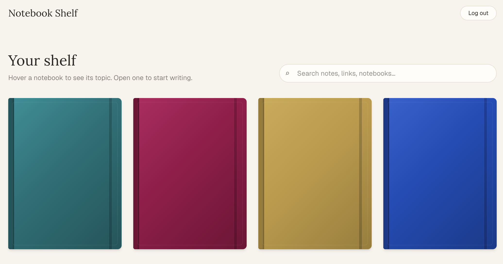
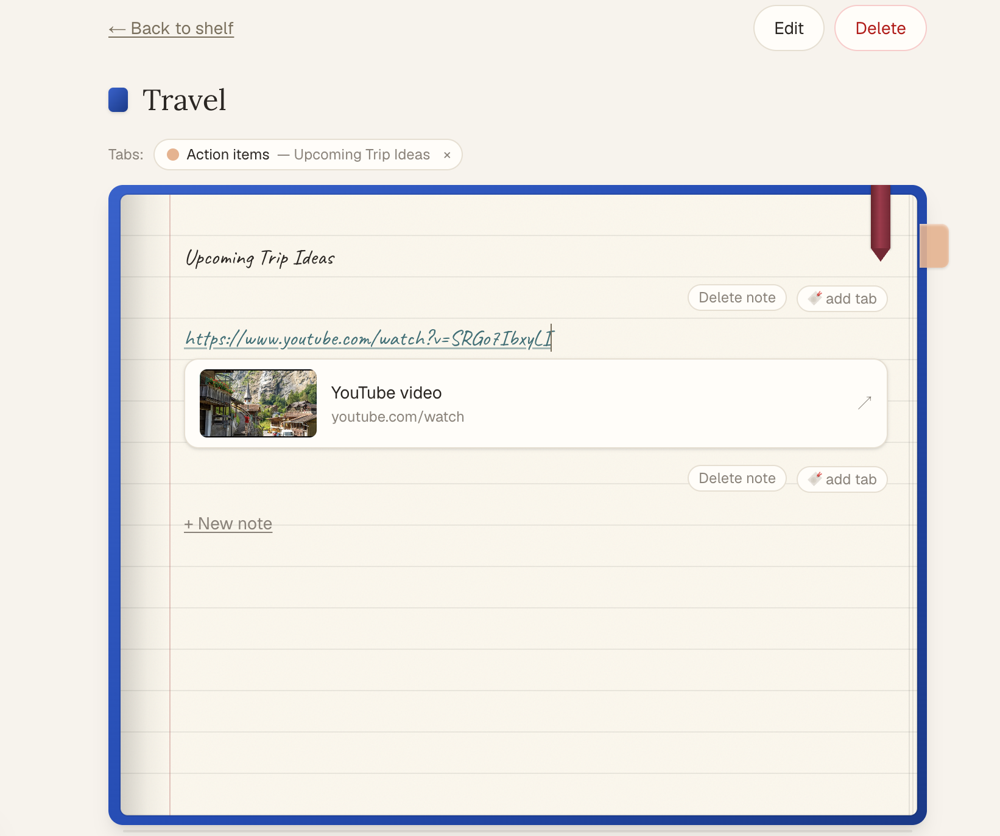

# Notebook Shelf

Notebook Shelf is a personal project. I don't actually use Google Docs or Word
for personal notes: they're not aesthetic enough to make me want to go back
and read them, and the layout never matches how I actually think about
note-taking. When I picture keeping track of something, I picture a rough,
physical notebook, not a grid-aligned document.

The problem is that most of what I want to remember comes from digital
content: YouTube videos, articles, links. A physical notebook can't hold a
timestamp or a hyperlink. So Notebook Shelf is my attempt at digitizing that
mental model: open the app to a shelf of notebooks, open one to lined paper
in a warm, curated font, write notes, and drop in links and YouTube
timestamps that jump straight back to the moment I wanted to remember. Each
notebook can be customized (cover color, page color, font) within a curated
set of options, enough to feel personal without turning into a full design
tool.

## Screenshots

**The shelf:** a forward-facing grid of notebooks with curated cover colors,
a hover-to-reveal topic, and search.



**Inside a notebook:** lined paper in a warm handwriting font, a bookmark
ribbon, a sticky tab, and a YouTube link that unfurled into a preview card.



## About this project

Notebook Shelf started from a full product requirements doc and was built
module by module (auth, then data model, then editor, then links, then tabs,
then search, then polish and a security pass) with an AI coding assistant
guiding each step. It's a real, working full-stack app: Supabase-backed auth
and Postgres with Row Level Security, a custom notebook page editor with
autosave and safe rendering of untrusted input, and a documented security
review with real fixes applied afterward (see `docs/SECURITY_CHECKLIST.md`
and `docs/SECURITY_LESSONS.md`).

It's laptop-first and built for a single primary user, but the data model,
auth, and RLS policies are all multi-user ready from day one.

## Tech stack

- Next.js (App Router) + React + TypeScript
- Tailwind CSS
- Supabase (Auth, Postgres, Row Level Security, full-text search)

## Local setup

Requirements: Node.js 18.18+ (Node 20+ recommended).

```bash
# 1. Install dependencies
npm install

# 2. Create your local env file (real values, never committed)
cp .env.example .env.local
# then fill in your Supabase project URL and anon key
#   NEXT_PUBLIC_SUPABASE_URL=...
#   NEXT_PUBLIC_SUPABASE_ANON_KEY=...

# 3. Run the dev server
npm run dev
```

Open http://localhost:3000. The landing page loads at `/`, and the
authenticated shelf loads at `/app`.

## Scripts

- `npm run dev`: start the dev server
- `npm run build`: production build
- `npm run start`: run the production build
- `npm run lint`: lint

## Environment variables

| Variable | Purpose |
| --- | --- |
| `NEXT_PUBLIC_SUPABASE_URL` | Supabase project URL (client-safe) |
| `NEXT_PUBLIC_SUPABASE_ANON_KEY` | Supabase anon key (client-safe, protected by RLS) |

Only the anon key is ever used on the client. The service-role key must never
appear in frontend code or the repo.

## Project structure

```
docs/                     PRD, schema.sql, security checklist and lessons, review notes
src/
  app/
    layout.tsx            Root layout and fonts
    page.tsx               Landing page (/)
    app/page.tsx           Authenticated shelf (/app), gated, greets user
    app/notebooks/[id]/    Notebook detail page and editor
    app/search/            Search page
    login/page.tsx         Email/password login (/login)
    signup/page.tsx        Email/password signup (/signup)
    globals.css            Tailwind and warm notebook theme
  components/               Notebook shelf, editor, links, tabs, search UI
  lib/                       Data access, server actions, validation helpers
  proxy.ts                   Route protection and session refresh (Next.js proxy)
supabase/migrations/         Numbered, checked-in SQL migrations
```

## Supabase setup (needed for auth)

1. Create a free project at https://supabase.com, then click **New project**.
2. In the project, open **Settings > API** and copy the **Project URL** and the
   **anon / public** key.
3. Put them in `.env.local` (see `.env.example`).
4. For instant login without email confirmation (fine for personal use), open
   **Authentication > Providers > Email** and turn **off** "Confirm email."
5. Restart `npm run dev`.

## Database migrations

SQL lives in `supabase/migrations/` as numbered files, committed to the repo.
Apply each one by pasting it into the Supabase **SQL Editor** and running it
(no CLI needed). `docs/schema.sql` is the full reference for all tables.

- `0001_notebooks.sql`: notebooks table and RLS
- `0002_notes.sql`: notes table, RLS, and search column
- `0003_links.sql`: links table and RLS
- `0004_sticky_tabs.sql`: sticky_tabs table and RLS
- `0005_tighten_sticky_tabs_policy.sql`: security fix verifying notebook_id
  ownership and note-to-notebook match on writes (see the security section
  below)
- `0006_note_content_length_limit.sql`: caps note content at 50,000 characters

## Feature overview

- Email/password auth with route protection
- Forward-facing notebook shelf with curated cover colors, page colors, and fonts
- Notebook page editor: lined paper, autosave, render-only pagination
- Hyperlinks and YouTube preview cards with thumbnails and timestamps
- Sticky tabs attached to specific notes, with a jump-to-note review strip
- Search across notebooks, notes, and links
- Physical-notebook details: an opening animation, a bookmark ribbon that
  remembers your place, paper texture, and book-edge shading

## Security summary

- **Auth:** Supabase email/password; `/app/*` gated by `src/proxy.ts`.
- **RLS:** enabled on every table; owner-only policies
  (`(select auth.uid()) = user_id`) with `WITH CHECK`, including
  parent-ownership checks on notes, links, and sticky tabs. `user_id` is
  filled by a database default, never trusted from the client.
- **Keys:** only the anon/publishable key is used on the client; the
  service-role key is never referenced in app code.
- **Headers:** a Content-Security-Policy scoped to Supabase and the YouTube
  thumbnail host, plus `X-Frame-Options: DENY`, `nosniff`, `Referrer-Policy`,
  and `Permissions-Policy`. See `next.config.ts`.
- **Untrusted input:** note content is stored and rendered as plain text
  (never `dangerouslySetInnerHTML`); pasted URLs are restricted to
  `http`/`https`; external links open with
  `target="_blank" rel="noopener noreferrer"`; link previews store metadata
  only (no page HTML, no video).
- **Fail-closed:** the proxy and `/app` both refuse to render, rather than
  silently allowing access, if Supabase env vars are missing in production.
- **Limits:** note content is capped at 50,000 characters (app and database
  constraint); passwords require 8+ characters (also set the same minimum in
  Supabase under Authentication > Policies, since the client-side check
  alone isn't enforced server-side).

A full, project-agnostic security checklist and a set of generalized
vulnerability patterns (with plain-language explanations) are included in
`docs/SECURITY_CHECKLIST.md` and `docs/SECURITY_LESSONS.md`. They were written
after a dedicated security review of this project and cover Row Level
Security patterns, fail-closed auth, input limits, and defense-in-depth
rendering checks that apply to any Supabase or Postgres-backed app.

### Security fixes applied after a dedicated review

- Fixed a gap where `sticky_tabs` RLS didn't verify `notebook_id` ownership,
  which would have let a caller pair their own note with an arbitrary
  notebook id. See `0005_tighten_sticky_tabs_policy.sql`.
- The proxy and `/app` now fail closed (HTTP 500) in production if Supabase
  env vars are missing, instead of silently rendering without auth.
- Added a server- and database-level cap on note content length.
- `LinkCard` re-validates the URL scheme and YouTube video id at render time,
  not just at write time, as defense in depth.
- Narrowed a broad `try/catch` around link syncing so only "table not created
  yet" errors are silently ignored; other failures are now logged by error
  code only.

## Manual QA checklist

Run through this before calling the MVP done:

- [ ] Sign up, log in, log out
- [ ] Logged-out `/app` (and `/app/notebooks/...`, `/app/search`) redirect to `/login`
- [ ] Create, edit, and delete a notebook (delete asks for confirmation)
- [ ] Topic never shows on the cover; appears on shelf hover and notebook header
- [ ] Open a notebook: lined paper uses the chosen page color and font
- [ ] Type notes; they persist after refresh, in order
- [ ] Backspace at a note's start merges it into the note above; "Delete note" removes one
- [ ] A new page appears past the bottom; page arrows and keyboard arrow keys navigate pages
- [ ] Reopening a notebook lands you where you left off (the ribbon)
- [ ] Pasting a normal URL creates a link card; pasting a YouTube URL creates a
      thumbnail card; a `?t=90` or `?t=1m30s` param adds a timestamp chip
- [ ] Adding a sticky tab (color and label) shows it as a side flag and a top
      tile; clicking jumps to the note; the x removes it
- [ ] Search finds notebooks, notes, and links; results jump to the note
- [ ] External links open in a new tab safely
- [ ] `.env.local` is git-ignored; `.env.example` has placeholders only; no secrets committed
